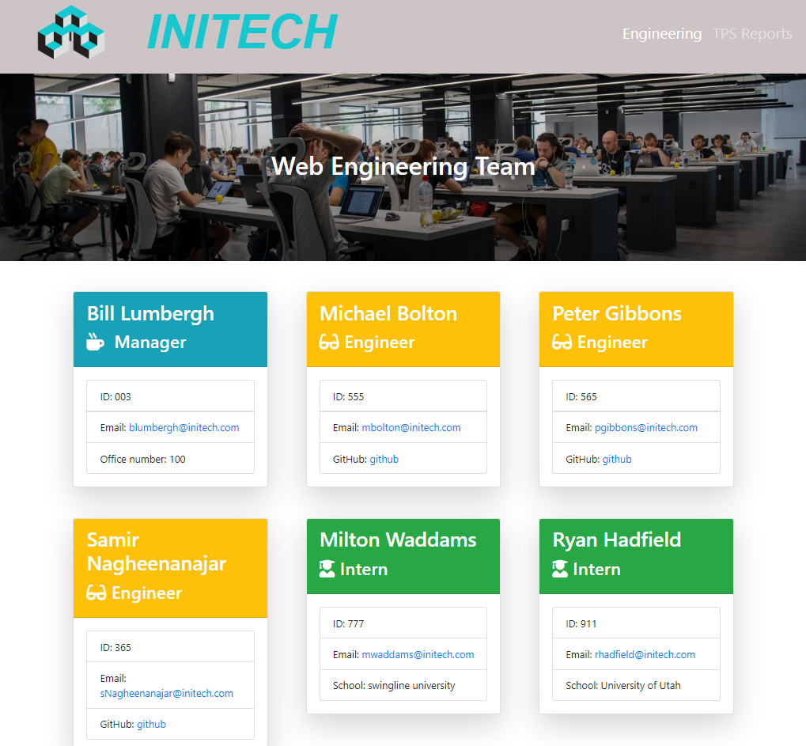

# Team Profile Generator

## Description

Use this [Node.js](https://nodejs.dev/) command-line application that takes in information about employees on a web engineering team, then generates an HTML webpage, using [inquirer.js](https://www.npmjs.com/package/inquirer) that displays summaries for each person. 
Testing is key to making code maintainable, so I've written a unit test using [Jest.js](https://jestjs.io/) to ensure the code passes the tests. 

Link to [walk through video](https://drive.google.com/file/d/1alWX3lKTcEL4QkLLzFKlir5iWiuj29et/view?usp=sharing) of how to use this app. 

Link to tests: [test video](https://drive.google.com/file/d/1TFUCY0LZ9sQkcgYv5703Le0GTEwnrs0a/view)

---

## Table of Contents (Optional)

- [Installation](#installation)
- [Usage](#usage)
- [Credits](#credits)
- [License](#license)

---

## Installation

- In order to run this application you'll need to make sure you have [NodeJS](https://nodejs.org/en/) installed on your computer.
- You can run this app through the integrated terminal in your [Visual Studio Code (VS CODE)](https://code.visualstudio.com/).
- You'll need to make sure you have files from this github repo on your computer.
- Once you have the integrated terminal open in VS code, run an "npm i" in the terminal.
- This should install a package-lock.jason file and node_modules.
- From here you'll want to type "node index.js" in your integrated terminal to initiate the application.

---

## Usage

You can quickly and easily create a HTML file by using this command-line application to generate one.

Once the application has been installed and initiated as per the above instructions you'll be prompted with a series of questions in your integrated terminal. Please fill out each of these questions and at the end of the questions you'll have a quality HTML file for your web engineering team.

---

## License

MIT License 

---

## Badges

---

## Questions

Github: https://github.com/ryanhadfield

Email: Ryan.Hadfield@gmail.com